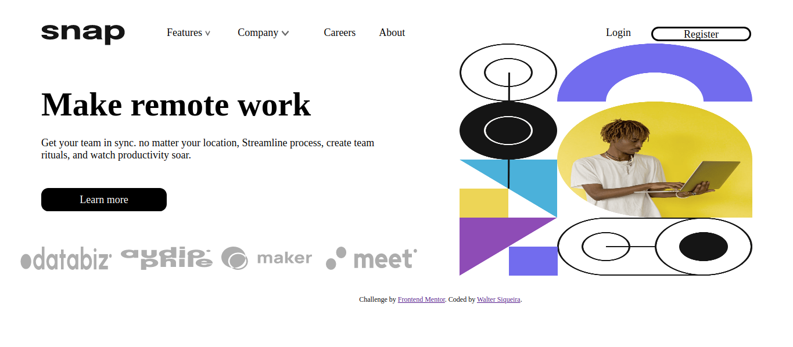

# Frontend Mentor - Intro section with dropdown navigation solution

This is a solution to the [Intro section with dropdown navigation challenge on Frontend Mentor](https://www.frontendmentor.io/challenges/intro-section-with-dropdown-navigation-ryaPetHE5). Frontend Mentor challenges help you improve your coding skills by building realistic projects. 

## Table of contents

- [Overview](#overview)
  - [The challenge](#the-challenge)
  - [Screenshot](#screenshot)
  - [Links](#links)
- [My process](#my-process)
  - [Built with](#built-with)
  - [What I learned](#what-i-learned)
  - [Continued development](#continued-development)
  - [Useful resources](#useful-resources)
- [Author](#author)
- [Acknowledgments](#acknowledgments)

**Note: Delete this note and update the table of contents based on what sections you keep.**

## Overview

### The challenge

Users should be able to:

- View the relevant dropdown menus on desktop and mobile when interacting with the navigation links
- View the optimal layout for the content depending on their device's screen size
- See hover states for all interactive elements on the page

### Screenshot

### Links

- Solution URL: [Repository](https://github.com/WalterSiqueira/Intro_Section)
- Live Site URL: [Vercel](https://intro-section-page.vercel.app)

## My process

### Built with

- Semantic HTML5 markup
- CSS custom properties
- Flexbox
- CSS Grid
- Mobile-first workflow
- [React](https://reactjs.org/) - JS library

### What I learned
In this project i've learned how to use React hooks and change style of elements but unfortunately i couldn't solve the menu on the mobile version.

### Continued development

In the next updates i want to build the menu function and fix some css failures.

## Author
- GitHub - [WalterSiqueira](https://github.com/WalterSiqueira)
- Frontend Mentor - [@WalterSiqueira](https://www.frontendmentor.io/profile/WalterSiqueira)
- Twitter - [@Walter__BS](https://twitter.com/Walter__BS)

